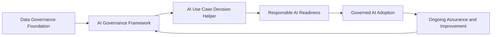

# Governance & Responsible AI Portfolio

> **Status:** Maintained reference implementation  
> **Last reviewed:** October 2026

This portfolio contains a set of practical data governance, AI governance and Responsible AI resources.

The repositories are designed to work as a connected set rather than as competing frameworks. Organisations can use individual components independently or combine them into a broader governance model.

## How the repositories fit together

The overall model is intentionally simple:

**Govern the data → govern the AI → assess the use case → assess readiness → adopt safely → monitor and improve.**

## Repository roles

### Data Governance Framework

Establishes the organisational foundations for effective governance, including:

- data ownership and accountability
- data quality
- access and privacy
- lifecycle management
- risk-based controls
- governance operating models

This provides much of the foundation required for responsible AI adoption.

### Data Governance Toolkit

Provides focused implementation resources for putting data governance into practice, including areas such as:

- data classification
- data lineage
- governance decision rights
- operational data management

It complements the broader Data Governance Framework with more focused implementation material.

### AI Governance Framework

Extends governance principles into the adoption and operation of artificial intelligence.

It focuses on areas such as:

- AI risk
- responsible use
- data protection
- governance controls
- accountability
- human oversight
- ongoing assurance

This acts as the central AI governance layer of the portfolio.

### AI Use Case Decision Helper

Provides a practical way to assess proposed AI use cases before implementation.

It considers factors including:

- business value
- data sensitivity
- risk
- human oversight
- governance requirements

The objective is not simply to approve or reject AI, but to determine what level of control and review is appropriate.

### Responsible AI Readiness

Provides an interactive assessment of organisational readiness for responsible AI adoption.

It considers areas including:

- data governance
- risk management
- organisational controls
- human oversight
- monitoring

It can help identify governance gaps before AI adoption is expanded.

### Governed AI Adoption

Shows how governance can operate alongside practical AI adoption.

The model covers:

- governance foundations
- controlled pilots
- user enablement
- acceptable use
- measurement
- feedback
- responsible scale-up

It demonstrates how governance can enable experimentation rather than becoming a separate approval barrier.

## Using the portfolio

Not every organisation will need every component.

The resources are deliberately modular:

- organisations beginning with data governance can start with the **Data Governance Framework**
- organisations establishing AI controls can use the **AI Governance Framework**
- proposed AI initiatives can be assessed using the **AI Use Case Decision Helper**
- organisational capability can be tested using **Responsible AI Readiness**
- practical adoption can then be supported through **Governed AI Adoption**

The objective across the portfolio is consistent:

> Enable useful technology adoption while maintaining proportionate governance, accountability and risk management.

---

These resources are practical reference implementations rather than prescriptive standards. They are intended to be adapted to the size, risk profile, regulatory environment and operating model of each organisation.